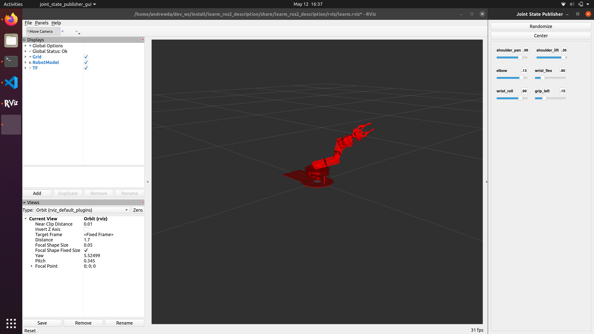

# learm_ros2

A collection of ROS 2 packages for controlling the
[Hiwonder LeArm](https://www.hiwonder.com/store/learn/2.html).

## Requirements

```bash
$ sudo apt-get install libusb-1.0-0-dev libudev-dev
$ pip install --upgrade setuptools
$ pip install hidapi
$ pip install xarm # see notes below
```

I ran into issues with the `xarm` package published on pip (specifically, my arm
has servo values from 500-2500 instead of the 0-1000 that the package expects).
If these issues apply to you as well, install my forked version:

```bash
$ pip uninstall xarm
$ pip install git+https://github.com/andrewda/xarmservocontroller.git#subdirectory=Python
```

Additionally, if you encounter errors while trying to connect to the arm, try
adding the following udev rule to `/etc/udev/rules.d/99-xarm.rules` or
similar:

```udev
SUBSYSTEM=="usb", ATTR{idVendor}=="0483", ATTR{idProduct}=="5750", MODE="0660", GROUP="plugdev"
```

Then reload the rules with:

```bash
$ sudo udevadm control --reload-rules && udevadm trigger
```

This rule will allow users in the `plugdev` group to access the arm controller.

## Packages

| Name | Description |
|------|-------------|
| learm_ros2 | A simple follower that commands arm servo positions from joint states published on the `joint_states` topic. |
| learm_ros2_description | LeArm description files, including arm meshes and URDF files. |
| learm_ros2_moveit_config | MoveIt config files (WIP). |

## Running

Make sure that the LeArm is plugged into a power source, turned on, and
connected over USB. Then start the follower:

```bash
$ ros2 launch learm_ros2 follower.launch.py
```

Next, if you want to manually control the arm for testing, start RViz and the
joint publisher:

```bash
$ ros2 launch learm_ros2 run.launch.py
```


